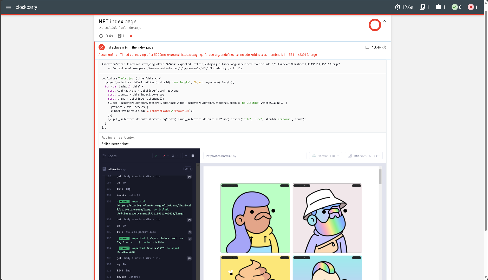

# Blockparty Full-Stack QA Engineer Technical Assessment

Sample project to Blockparty Full-Stack QA Engineer Technical Assessment with [Next App](README.md).

### Pre-requirements

It is required to have Node.js and npm installed to run this project.

> I used versions `v20.13.1` and `10.5.2` of Node.js and npm, respectively. I suggest you use the same or later versions.

### Installation

Run `npm install` (or `npm i` for the short version) to install the dev dependencies.

## Tests

Run `npm run cy:test` to run the test in headless mode.

Or, run `npm run cy:open` to open Cypress in interactive mode.

## Interpret the results

Cypress provides detailed test results and generate a report to better understand about:.

- Visibility: They provide a clear overview of test results, allowing stakeholders to quickly assess the application's functionality.
- Debugging: They help identify and debug issues by detailing failing tests, error messages, stack traces, and screenshots.
- Metrics and Trends: They include metrics like test pass rates, execution times, and historical trends, helping teams track progress and spot patterns.
- Documentation: They document test cases and outcomes, aiding in understanding the purpose and expected behavior of tests.
- Decision Making: They offer insights for decision-making, such as prioritizing bug fixes, optimizing test coverage, and allocating resources effectively.

---

- [Cypress CI](README-CI.md)
- [Next App](README.md)
- [K6 Testing](README-K6.md)
- [K6 CI](README-K6-CI.md)

---

This project was created by [Kaio Azevedo].
